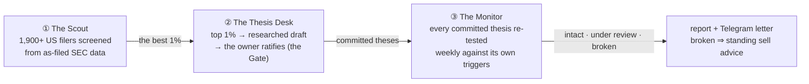
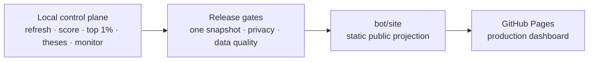

# Invest AI

> **Not investment advice.** This is a research and educational tool. Nothing it
> produces — scores, theses, triggers, reports, the public site — is a
> recommendation to buy or sell any security, and none of it should be the sole
> basis for an investment decision. Output can be wrong, stale, or incomplete.
> Do your own research and consult a licensed financial advisor before
> investing. The system never executes trades.

**An AI-operated investment desk: it finds wonderful businesses, writes the
argument for owning them, and then checks that argument every week — mechanically,
against rules committed in advance. It advises and monitors. It never executes a
trade.**

**See it live:** the desk publishes itself every Saturday —
[the public site](https://qpec.github.io/invest-ai/) shows the whole screened
universe, the draft theses, and the monitor state. **Run it yourself:**
[QUICKSTART.md](QUICKSTART.md) goes from clone to a working local desk on a
bundled sample dataset in a few minutes, with Claude Code or OpenClaw as the
judgement runtime.

The core object is not the stock but the **investment thesis**: a written,
machine-checkable document stating why we would own a business and — more
importantly — the pre-committed conditions under which we would leave. Research is
done by an AI agent; every number and every rule is validated by plain Python; the
buy decision belongs to a human, always.

The judgement framework is a constitution the code enforces rather than hopes for:
**Buffett** (what to buy: moats, owner earnings, the 10-year test), **Munger**
(what to avoid: inversion, the Hell-No filter, psychology traps), **Naval** (keep
upgrading: the system itself is leverage — software that works while you sleep).

---

## The three components



### ① The Scout — *what is worth a look?*

Screens the whole universe from the SEC's own filings (point-in-time discipline:
nothing is known before EDGAR knew it) and grades every name **twice,
independently**: the *Owner's Scorecard* asks how good the business is; the
*Inversion Layer* asks how it would lose your money. The two verdicts are never
merged — a business can be Exceptional *and* Fragile, and that tension is the
information. A tiered fetch chain (bulk export → live EDGAR → labelled vendor
display values) keeps 26 registry metrics filled, each with its provenance.

### ② The Thesis Desk — *why would we own this, and what would make us leave?*

There is **no LLM API client in this repo**. An agent harness (Claude Code /
OpenClaw) *is* the runtime: Python writes a work order, the agent researches with
its own tools and writes the draft, and Python re-validates every rule
mechanically — refusing the work if a trigger is untestable, a forbidden field
appears, or the model used is not on the owner's best-available list. A draft
becomes real only at **the Gate**, where the owner — a human, always — adds
conviction and circle-of-competence and ratifies. The agent is trusted for
research and prose, never for the contract.

### ③ The Monitor — *is the argument still true?*

Every Saturday, each committed thesis is re-tested against **its own pre-committed
triggers** — never open-ended news scanning. Metric triggers are pure arithmetic
on fresh filings; judgement questions go to the agent, and an unanswered one is
reported **UNCHECKED**, loudly — silence is never safety. A tripped break trigger
makes the thesis **broken**: standing sell advice that ignores cost basis, sticky
until the owner acts. "No action needed" is the celebrated first-class outcome.

---

## Production operation

The local container is the control plane and GitHub Pages is the read-only
production dashboard. One fail-atomic job owns the complete snapshot:



Daily runs refresh and rescore after the US close. Saturday's deep run also
revalidates universe identity, filing freshness and every top-1% research input.
Manual runs use exactly the same path. A failure leaves the last valid Pages
snapshot live.

Publication also requires an accepted draft for every top-1% candidate. The
repository writes and validates work orders, while an approved Claude Code or
OpenClaw judgement runtime performs the research; missing drafts fail the run
explicitly at `thesis_evaluations_passed`.

The public portfolio-monitor page contains symbol, public thesis, status,
monitor evidence and optional target weight. Quantities, purchase prices,
market values and account fields stay local and are rejected by release gates.

### Local production commands

```bash
# Configure durable paths and a credential-safe GIT_ASKPASS helper outside Git.
cp deploy/local/scout-production.env.example \
  /home/openclaw/config/invest-ai-production.env

# Same end-to-end path used by both timers.
SCOUT_PRODUCTION_ENV=/home/openclaw/config/invest-ai-production.env \
  deploy/local/scout-production.sh manual

# Inspect a run without publishing anything.
.venv/bin/python stock-scout/production.py status \
  --db-dir /home/openclaw/projects/invest-ai/var/scout/agentcy-local-v4 \
  --run-id RUN_ID
```

Install `deploy/systemd/scout-production@.service` with its daily and weekly
timers only after the first validated publication and after retiring the legacy
publisher. Rollback is a normal revert on `bot/site`; the local append-only run
history remains intact. Paid data providers are documented as inactive options
in [the completeness research](docs/research/2026-08-07-paid-data-completeness-options.md).

## The interface

- **The desk site** — Scout · Thesis · Monitor as three numbered tabs: the whole
  screened universe with filters and per-name drill-down (all 26 metrics with
  provenance badges, both verdicts side by side), draft theses in full with live
  trigger safety-margins, and the weekly monitor state. Self-contained HTML,
  light/dark, keyboard-first. Served by GitHub Pages from `docs/`.
  Run `python webapp.py --serve` locally and the page's **Desk actions** come
  alive — refresh filings, draft a thesis, run the monitor, rebuild the page —
  loopback-bound and token-gated. On the public mirror those same buttons are
  disabled with "local setup required": the desk runs on *your* machine with
  *your* agent, so no one spends anyone else's tokens or compute. Ratifying is
  never a button (FR9).
- **Telegram** — the daily/weekly letters, failure alerts, and the OpenClaw
  channel for talking to the desk ("draft the new top-1%").
- **The desk CLI** — `agentcy run {daily,weekly,quarterly,event}`, and the thesis
  engine's three beats: `thesis.py brief → record → ratify`,
  `monitor.py brief → run`.

## Principles the code enforces (not a style guide — tested seams)

- The two judgements are **never merged** into one score; composites (Piotroski,
  Altman) are display-only and structurally unable to fire a trigger.
- **No price-based triggers**: a falling quote with an intact thesis is an
  opportunity, not an invalidation; recommendations ignore cost basis.
- **Human judgement is sacred**: conviction and the buy decision have no field in
  any machine-written schema; only the interactive Gate can commit a thesis.
- **Best-available models only**, read from the harness transcript rather than
  asked of the agent; a lesser or lying model is refused at validation.
- **Refuse, never guess**: an uncomputable metric is reported absent — with its
  provenance tier when present — and absent data can veto safety claims, never
  certify them.

## Deeper documentation

| Doc | What it covers |
|---|---|
| [`stock-scout/README.md`](stock-scout/README.md) | the pipeline in full: model, rules R1–R22, files |
| [`stock-scout/docs/THESIS-DESIGN.md`](stock-scout/docs/THESIS-DESIGN.md) | the thesis engine and the agent-as-runtime seam |
| [`stock-scout/docs/REGISTRY-DESIGN.md`](stock-scout/docs/REGISTRY-DESIGN.md) | the 26-metric registry: audit, sources, formulas |
| [`stock-scout/docs/INVERSION-DESIGN.md`](stock-scout/docs/INVERSION-DESIGN.md) | the Munger layer's seven fragility probes |
| [`docs/plans/`](docs/plans/) | binding design history: functional baseline → technology → distributed desk |
| [`docs/runbook.md`](docs/runbook.md) | operating the local desk |

*(Repository renamed from `stock-agentcy` 2026-08-05; internal module names keep
the working name so the design-doc history stays true.)*

## Development

```bash
uv run pytest -q                      # root suite — fully offline; network in a test is a failure
cd stock-scout && uv run pytest -q    # scout suite
uv run python tools/license_gate.py   # permissive licences only — no GPL family, enforced
```

Branch → adversarial review → merge; every load-bearing decision is journaled in
`docs/plans/` with the evidence that produced it.
