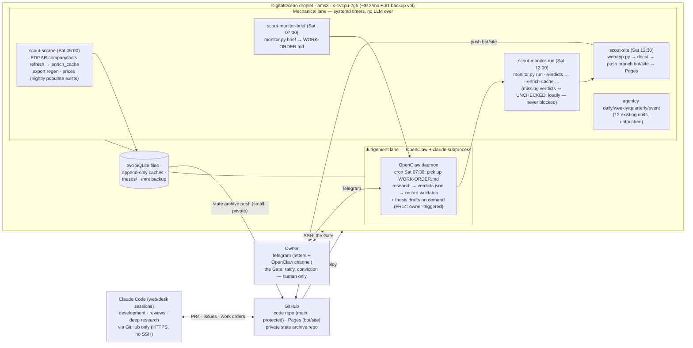

# The Distributed Desk — one box, one seam (GitHub), the agent beside the data

**Status:** design, 2026-08-04. Owner-directed: *"a workflow architecture where a VPS box
is doing the scraping for data and the LLM based jobs can be performed through claude
code or an connected agent. The code being on github."* Decisions taken by the owner,
2026-08-04, via the desk session:

| Decision | Choice | Rejected alternatives |
|---|---|---|
| Agent runtime for LLM jobs | **OpenClaw daemon on the VPS** | GitHub-relay into scheduled Claude Code web sessions; both |
| Bulk data medium | **Stays on the box** | DO Spaces + git data-repo; git-LFS |
| Database | **None new — the ratified SQLite files + append-only file caches** | managed Postgres; DuckDB-on-Spaces |

One auth fact shapes the agent lane and is journaled because it was verified, not
assumed: OpenClaw's supported subscription path is **Claude CLI reuse** — the `claude`
binary is installed and logged in on the box, and OpenClaw drives it as a subprocess that
authenticates natively against the owner's subscription (the static `setup-token` route
exists but broke once already, April 2026, and is treated as a fallback). Two
consequences:

- "Claude Code or OpenClaw" is not a fork on the box: **OpenClaw is the always-on
  gateway; Claude Code is the engine underneath it.** No API key anywhere, honouring the
  2026-08-03 lock ("run by claude code or openclaw. Not api").
- The best-available **model gate keeps its teeth**: the claude subprocess writes
  transcripts under the box's `~/.claude/projects/`, which is what
  `deskwork.observed_model()` reads — *when* the validation command runs as a tool
  inside that claude session (then `CLAUDE_CODE_SESSION_ID` is set). Verify at install;
  any run mode without a transcript degrades to the labelled `--model`-declared path
  that already exists (`NOT independently verified` on the record).

## 1. The shape

Three principles carried over, now with a topology:

- **The thesis drives the monitoring** — the box only ever executes pre-committed
  triggers; OpenClaw's cron entry answers the brief's questions, it never scans news
  open-endedly, and the Scout batch remains owner-triggered (FR14: no idea-generation
  cron exists, deliberately).
- **The agent is trusted for research and prose, never for the contract** — unchanged:
  `record`/`run` re-validate everything mechanically on the same box, and a dead or
  misbehaving OpenClaw degrades to an UNCHECKED-loud monitor run, never a blocked one.
- **Judgement and arithmetic never swap lanes** — the mechanical lane has no LLM in it
  (the 2026-07-08 lock survives *inside* the box even though the box now hosts an
  agent); the judgement lane cannot fire a trigger, only answer questions the owner
  pre-committed — and, per §4, cannot even write where committed theses live.

## 2. GitHub is the only seam between machines

| Repo / branch | Contents | Who writes | Who reads |
|---|---|---|---|
| `qpec/stock-agentcy` `main` (**protected**) | code | Claude Code sessions + owner only | the box pulls on deploy |
| `qpec/stock-agentcy` `bot/site` | the rendered `docs/` site | the box | the Pages workflow deploys it |
| `qpec/stock-agentcy-state` (new, **private**) | `theses/` (drafts + committed) · `reports/` · decision journal · `verdicts/` | the box (after each monitor run / ratification) | the owner anywhere; Claude Code sessions when asked to review |

Containment for the box's credential, in order of the protection doing the work:

1. The box's token is a **fine-grained PAT with `contents:write` only** on the two
   repos. Without the `workflow` scope it cannot create or modify Actions workflows —
   GitHub rejects such pushes — so the box can never rewire CI.
2. **`main` is branch-protected** ("restrict who can push": owner + the Claude GitHub
   app). The box publishes the site to `bot/site`, and `pages.yml`'s trigger moves from
   `main`/`docs/**` to `bot/site` — so a compromised box (or a prompt-injected agent on
   it) can vandalise the *site branch* at worst, never the code or the workflows. Site
   history makes any vandalism visible and revertible in one command.
3. The state repo is private and holds the FR9 material (conviction lives there and in
   the site payload never — `webapp.strip_owner_fields` is tested for exactly this).

The state repo is the tech-arch's "rendered-markdown archive in its own git repo",
promoted to the off-box copy. It is small (KB per week), and it is what lets a Claude
Code web session participate at all: sessions are HTTPS-only (no SSH), so anything they
should read must reach GitHub. Bulk data (the ~700MB export, price grids, companyfacts
cache) deliberately never leaves the box — a session that needs numbers gets them the
way the agent seam always delivered them: inside the work order's packet.

## 3. The weekly relay, end to end (Saturday; timers run in the box's Europe/Amsterdam tz, set at install)

| Time | Unit / actor | Does | On failure |
|---|---|---|---|
| 01:30 (nightly) | `agentcy-populate` (exists) | paced price walk | existing `agentcy-fail@` alert |
| 06:00 | `scout-scrape` (new) | EDGAR enrichment refresh for monitored + shortlist symbols (cache-first, paced, fill-only-missing); export regen; universe refresh | monitor still runs on last good data and *reports staleness* (NFR1) |
| 07:00 | `scout-monitor-brief` (new) | `monitor.py brief` → `WORK-ORDER.md` + `questions.json` into the spool | no committed theses ⇒ prints so, exits 0 |
| 07:30 | OpenClaw cron | reads the work order, researches each question (budget per SKILL.md), writes `verdicts.json` | no verdicts by 12:00 ⇒ nothing blocks |
| 12:00 | `scout-monitor-run` (new) | `monitor.py run --verdicts … --enrich-cache … --model …`; sticky-broken, confidence gate, UNCHECKED loud | monitor's own error isolation per thesis |
| 12:30 | `scout-site` (new) | `webapp.py` rebuild → push `bot/site`; push state archive | site is presentation; failure alerts but never touches state |
| 12:35 | existing letter path | Telegram letter links the report; dead-man ping fires | healthchecks.io alerts if the whole morning died |

The sequencing doubles as the memory plan: on 2GB, the pandas jobs (06:00, 12:00) and
the claude subprocess (07:30–) never run concurrently by schedule; a **2GB swapfile** is
provisioned as insurance rather than upsizing the droplet up front. Disk: worst case
today is ~8GB (export + caches + node + venvs) against the droplet's 50GB.

Thesis drafting (the Gate pipeline) is not scheduled: the owner triggers it — a Telegram
message to OpenClaw ("draft the new top-1%") or a desk session — and ratification stays
a human ritual over SSH (`thesis.py ratify` as the `agentcy` user), where FR9's
questions are asked interactively. §4 makes "nothing else can ratify" a filesystem
fact, not a policy hope.

## 4. OpenClaw on the box — setup and hardening

- **Install:** Node 22+, `openclaw onboard --install-daemon` → its own systemd unit,
  running as a dedicated `openclaw` user (not `agentcy`, not root).
- **Auth:** Claude Code CLI installed for the same user, logged in with the owner's
  subscription; OpenClaw configured for Claude-CLI reuse. No `ANTHROPIC_API_KEY`
  anywhere on the box. If the login ever expires on the headless box (it refreshes
  itself in normal operation), the failure mode is the benign one — UNCHECKED-loud
  monitor + a letter that says so — and the runbook entry is one line: SSH in,
  `claude login`, re-run the OpenClaw job.
- **Model:** pinned to the best available (currently the Opus 5 line) in OpenClaw's
  config — the same id `deskwork.APPROVED_MODELS` enforces, so `record` refuses drift.
- **Filesystem seam (this is the Gate's lock):** the `openclaw` user gets write access
  to exactly `theses/drafts/` and the monitor spool; read-only on the caches and
  reports; **no write permission on `theses/committed/`, no access to the SQLite
  files, no git credentials.** `ratify` runs as the `agentcy` user and is the only
  path that writes `committed/` — so an agent (or anything that hijacks it) cannot
  commit a thesis, cannot touch state, and cannot push anywhere. The judgement lane
  reads the open web by design, which means prompt injection is an assumed input, not
  a surprise: the blast radius is a bad *draft* or a bad *verdict*, both of which the
  mechanical lane validates, labels, and can only ever turn into "review" or
  "UNCHECKED" — never a silent action.
- **Network posture:** gateway bound to loopback only, no public port; the Telegram
  channel allowlisted to the owner's chat-id (the `tg.py` pattern already pins it);
  OpenClaw's web UI disabled. Droplet firewall: 22 (key-only) in, 443 out.
- **Blast radius:** OpenClaw down ⇒ the monitor runs UNCHECKED-loud and the letter says
  so; the mechanical lane, letters, backups and site are fully independent of it.

## 5. Database: none new, on purpose

The box keeps the ratified state: **two SQLite files** (benchmark physically
quarantined) plus append-only file caches with provenance ledgers. The workload is one
writer, weekly batch, point-in-time append-only — a server database would add ~$15/mo, a
network dependency inside the trust boundary, and an ops surface, for zero concurrent
queries. Durability = the existing backup timer to `/mnt/agentcy-backup` (extended to
cover the scout dirs: enrich_cache, theses, reports) + the private state repo as the
off-box copy of everything human-readable. If ad-hoc multi-year PIT queries are ever
wanted, the upgrade path is DuckDB over parquet snapshots — a desk tool, not a server —
addable later without touching this architecture.

## 6. What Claude Code (web) remains for

Development and review (this session's pattern: branch → adversarial review → merge),
deep research when the owner prefers a desk-quality session, and reading anything the
box pushed to GitHub. It is not in the weekly loop's critical path — by the owner's
choice of OpenClaw — but the seam is symmetric: a work order is a file, so either
harness can execute one, and `record` cannot tell the difference. That symmetry is the
insurance if OpenClaw's auth path ever breaks again the way setup-token did in April.

## 7. Migration checklist (ordered; each step independently safe)

1. **Owner supplies** (blockers, same as `deploy/digitalocean/README.md`): DO API
   token, SSH key in DO, Telegram bot token + chat-id; plus two new items — a
   fine-grained PAT (`contents:write`, the two repos, no `workflow` scope) and the
   `main` branch-protection click (restrict pushers to owner + the Claude app).
2. `deploy/digitalocean/provision.sh` → droplet + backup volume (exists; add the
   swapfile step).
3. `install.sh` → the agentcy runtime as designed (exists, unchanged).
4. **New (follow-up implementation task once this design is ratified):**
   `deploy/systemd/scout-*.{service,timer}` (the four units above),
   `deploy/openclaw/` (install script, config template, the user/permission seam of
   §4), the `pages.yml` trigger switch to `bot/site`, and the backup-unit extension.
5. Create `qpec/stock-agentcy-state` (private), seed from the box, wire the push into
   `scout-monitor-run`/`scout-site`.
6. First supervised Saturday: watch the relay end to end; then the dead-man ping owns
   the silence.

## 8. Costs

Droplet $12 + backup volume $1 ≈ **$13/mo**, unchanged from the ratified deployment. No
Spaces, no managed DB, no API metering — the LLM spend is the existing Claude
subscription. GitHub private repos and Pages: $0.
